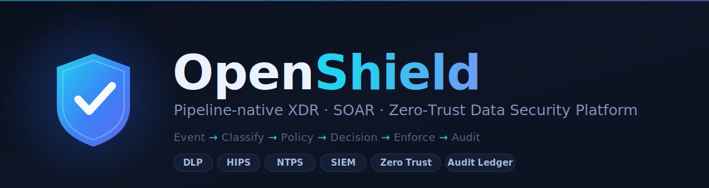
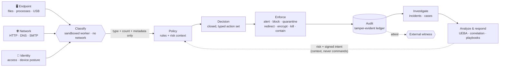
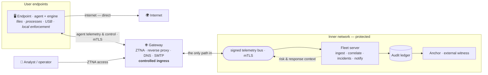

<div align="center">



<br/>

[](https://github.com/lucianoengel/openshield/actions/workflows/ci.yml)
[](https://goreportcard.com/report/github.com/lucianoengel/openshield)
[](go.mod)
[](LICENSE)
[](#-project-status)
[](#-components)

**One pipeline. Every layer. Tamper-evident by design.**

A pipeline-native **XDR + SOAR** data-security platform — DLP, HIPS, network prevention, SIEM,
and Zero-Trust access, unified by a single detection-and-response pipeline and a forward-secure
audit ledger where *every* decision is courtroom-grade evidence.

[Roadmap](docs/architecture-roadmap.md) · [Architecture](#-architecture) · [Decisions](docs/decisions.md) · [Threat model](docs/threat-model.md) · [Contributing](#-contributing)

</div>

---

> ### ⚠️ Project status
> **OpenShield is pre-alpha.** The **observe path runs end-to-end as a binary** — a real file
> dropped in a watched directory is classified in a sandboxed worker, evaluated against policy, and
> lands an `ALERT` in the hash-chained ledger ([`deploy/observe-e2e.sh`](deploy)). A fleet control
> plane, mutual-TLS transport, network gateway, HIPS process pipeline, and server-side correlation
> are built and tested. **Inline blocking (the privileged permission-mode agent) is deferred**, and
> the platform is **not yet production-hardened**: no packaged release, single-node durability. The
> maturity table below is honest about where each capability actually stands. See the
> [roadmap](docs/architecture-roadmap.md) for the exact queue.

## 🔍 Overview

Most security suites bolt DLP, EDR, NDR, and SIEM together as separate products with separate
data models. OpenShield is the opposite bet: **one fixed pipeline** absorbs every capability as a
plugin, so a network detector, an endpoint process rule, and an identity signal all flow through
the same stages and land in the same tamper-evident evidence store.

```
Event  →  Classify  →  Policy  →  Decision  →  Enforce  →  Audit  →  Investigate  →  Analytics
```

New capability arrives as a new **Producer** (event source), **Classifier** (detector),
**Policy** input, or — rarely and deliberately — **one new typed Action**. The core never changes.
That discipline is what lets OpenShield span seven security domains without becoming seven codebases.

## ✨ Why OpenShield

- **🔗 One pipeline, every domain.** Endpoint files, process exec, DNS, SMTP, USB, and network flows
  are all just *Events*. Add a producer, reuse the whole stack.
- **🛡️ The control plane cannot actuate.** The `Action` set is **closed, typed, and
  parameterless** — a compromised server can place a subject under containment, but can never
  express "run this command." Enforcement decisions are made *locally*; the server coordinates, it
  does not control.
- **🔒 Content never leaves the sandbox.** Untrusted bytes are parsed in a seccomp-hardened worker
  with no network; only **type + count + metadata** cross the boundary — never the sensitive content
  itself.
- **⛓️ Every decision is evidence.** A per-agent, forward-secure, hash-chained ledger with external
  anchoring makes the audit trail tamper-evident — an independent witness the ledger writer cannot
  impersonate. This is the platform's crown jewel.
- **🧪 Tests that can't lie to themselves.** Security properties are proven by re-introducing the
  bug (mutation testing) on live Postgres/NATS/TLS, not by mocks that share the code's assumptions.
- **📖 Honest by construction.** The docs say what runs, what's deferred, and what's still a claim.

## 🧭 Capabilities

OpenShield is architected as a **pipeline-native XDR**, with each domain a detection lens over the
shared pipeline. Maturity is tracked candidly — detection *breadth* is cross-domain, but
cross-domain *correlation* and SOAR *orchestration* are the current build focus.

| Domain | Maturity | What works today |
|---|:---:|---|
| 🧬 **XDR** (umbrella) | 🟠 ~25% | Detection across endpoint/network/identity; correlation is still single-domain — the entity graph + cross-domain correlation are the strategic lane. |
| 🔐 **Zero Trust (ZTNA)** | 🟡 ~55% | Access broker, microsegmentation, real OIDC/JWT on-path (alg-confusion rejected), dual-credential + signed device posture. |
| 🗂️ **DLP** | 🟡 ~45% | Sandboxed detection core, enforcement wiring, compliance packs (PCI/HIPAA/GDPR), broad PII/secret detectors. |
| 🌐 **NIPS / NTPS** | 🟠 ~30% | Inline HTTP prevention (TLS-intercepting proxy), live DNS + SMTP inspection, rate-limited listeners. |
| 📊 **SIEM** | 🟠 ~35% | Event search, materialized incidents, cross-host correlation, alert lifecycle, UEBA baselines, syslog. |
| 🖥️ **HIPS** | 🟠 ~30% | Endpoint process pipeline runs end-to-end: auditd exec source → behavioral detection → `KILL_PROCESS`. |
| 🤖 **SOAR** | 🔴 ~10% | Four-eyes cases, incidents, signed webhooks — orchestration (playbooks, response intents) is approved and queued. |

<sub>⛓️ **Crown jewel:** the forward-secure hash-chained ledger + external anchoring is real,
end-to-end, and the strongest asset — every domain above writes evidence into it.</sub>

## 🏗️ Architecture

**One pipeline, every signal.** Endpoint, network, and identity telemetry all flow through the same
stages. Detection and enforcement are kept strictly separate — an enforcer receives only a
*decision*, never which detector matched or why:



**A stable core, plug-in capability.** The pipeline's core — the dispatcher, the stages, the enforcer
contracts, and the ledger — stays fixed. New capability lands as a new event source, a new detector,
a new policy input, or one deliberate new action, never as a change to the core. That discipline is
what lets a single codebase span seven security domains instead of fragmenting into seven products.

**How it deploys** — the control plane runs inside a **protected inner network**. End users reach the
internet directly, but **agent telemetry and control traffic transit the gateway** — the controlled
ingress (ZTNA / reverse proxy) — because that is the only path into the inner network where the control
plane runs. Inside, the server correlates across domains, writes tamper-evident evidence, and publishes
risk and response *context* back out to the agents over the same path:



## 🧩 Components

OpenShield ships as focused, single-responsibility binaries (all Go, `cmd/`):

| Binary | Role |
|---|---|
| **`openshield-engine`** | The endpoint pipeline. Unprivileged, network-capable; watches directories via notify-mode fanotify, classifies via the worker, evaluates policy, decides, and appends to the ledger. |
| **`openshield-worker`** | The unprivileged, seccomp-hardened parser. Reads classify requests, opens files with its own credentials, classifies untrusted bytes — holds no network and no secrets. |
| **`openshield-gateway`** | The network data plane. TLS-intercepting forward proxy (egress DLP), ZTNA access broker, and DNS/SMTP inspection — each request classified in the sandboxed worker. |
| **`openshield-server`** | The fleet control plane. Ingests signed telemetry over NATS, persists the fleet aggregate, runs correlation/incidents and alert delivery. It coordinates and observes; it does not control. |
| **`openshield-fleet-agent`** | The fleet-facing endpoint half: generates a per-agent identity, enrolls, and publishes signed telemetry, heartbeats, and device posture. |
| **`openshield-agent`** | The privileged inline-enforcement agent (fanotify **permission** mode) — **deferred to Phase 2** (needs `CAP_SYS_ADMIN`; inline blocking, not yet wired). |
| **`openshield-provision`** | Issues the credentials the stack needs (enrollment tokens, client certs). Minimal provisioning for dev and small fleets — not a full PKI. |
| **`openshield-anchor`** | Witnesses the audit-ledger head and stores an external anchor. It attests to the head; it cannot append — a witness the ledger writer cannot impersonate. |
| **`openshieldctl`** | Operator CLI for querying and verifying the audit ledger. |

## 🚀 Getting started

**Requirements:** Go **1.26+**, Linux (fanotify), PostgreSQL, and NATS. Containers use **Podman**.

```bash
# Clone
git clone https://github.com/lucianoengel/openshield.git
cd openshield

# Build + verify everything (vet, tests, checks, binaries)
make all

# Or just compile the binaries under cmd/
make build
```

**See the observe path run end-to-end** — drop a real file in a watched directory and watch it land
an `ALERT` in the forward-secure ledger:

```bash
./deploy/observe-e2e.sh
```

Key configuration is via environment variables, e.g. `OPENSHIELD_WATCH_DIRS` (directories the engine
observes), `OPENSHIELD_ENFORCE` (opt in to post-decision enforcement; **observe-only by default**),
and `OPENSHIELD_DSN` (Postgres). See [`deploy/`](deploy) for compose and systemd examples.

## 🗺️ Roadmap

**Now — hardening the foundation:**
- Zero-Trust device identity and posture binding
- Composable compliance policy (PCI/HIPAA/GDPR packs that add protections without disabling others)
- SIEM reliability: notification integrity, a unified alert lifecycle, durable behavioral baselines
- Endpoint process-termination safety hardening
- Role-based access control for analysts

**Next — from breadth to depth:**
- 🧬 **XDR** — a unified entity graph and cross-domain correlation, so one attack surfaces as **one
  incident** across endpoint, network, and identity, with a full evidence timeline
- 🤖 **SOAR** — orchestration: automated playbooks, threat-intel enrichment, and a signed
  response-intent model where the control plane recommends but **never executes arbitrary commands**
- ⚙️ **Scale & resilience** — durable messaging, active-passive high availability
- 🌐 **Network prevention** — transparent inline interception plus a signature/threat-intel engine
- 🔏 **Hardware-backed device attestation**
- 🖥️ **Cross-platform agents** (Windows / macOS)

<sub>The detailed engineering plan and design-decision records are maintained in
[`docs/architecture-roadmap.md`](docs/architecture-roadmap.md).</sub>

## 🔐 Security model & design principles

OpenShield's guarantees come from a small set of deliberate, documented constraints:

- **Closed, typed action set.** The control plane can never express an arbitrary command; actions
  carry no free-form parameters. This is what makes *"the server coordinates, it does not control"*
  architectural rather than aspirational.
- **Content isolation.** Sensitive content is parsed only inside a sandboxed, network-less worker;
  only type, count, and metadata ever cross the boundary — never the content itself.
- **Observe by default.** Enforcement is opt-in; out of the box the platform detects and audits
  rather than blocks.
- **Deliberate egress fail-open.** Inline network paths fail *to wire*, never fail the network
  closed — availability is a conscious, documented choice for egress.
- **Tamper-evident evidence.** The forward-secure, hash-chained ledger with external anchoring can be
  independently verified, not merely trusted.

See the [threat model](docs/threat-model.md) and [design-decision log](docs/decisions.md) for the
full rationale.

## 📚 Documentation

| Doc | What's in it |
|---|---|
| [Architecture roadmap](docs/architecture-roadmap.md) | Live capability status, the prioritized plan, and the architecture-decision records |
| [Design decisions](docs/decisions.md) | The architecture-decision log behind the codebase |
| [Threat model](docs/threat-model.md) | Assets, adversaries, trust boundaries |
| [Architecture proposal](docs/architecture-proposal.md) | The original pipeline thesis |
| [DPIA template](docs/dpia-template.md) | Data-protection impact assessment scaffold |

## 🤝 Contributing

Contributions are welcome. A few house rules that keep the project honest:

- **Keep pull requests focused** — one self-contained change at a time.
- **Tests must drive the real runtime path**, never a mock built from the code's own assumptions.
  For every security property, add an adversarial test that re-introduces the bug and proves the test
  catches it.
- **Respect the stable core.** New capability should land as a new event source, detector, policy
  input, or action — not as a change to the core pipeline.
- Run `make all` (vet, tests, `-race`, checks, build) before opening a PR.

Use [conventional commits](https://www.conventionalcommits.org/) (`feat:`, `fix:`, `refactor:`, …).

## 📄 License

Licensed under the **[Apache License 2.0](LICENSE)**.

<div align="center"><sub>Built in the open · <code>github.com/lucianoengel/openshield</code></sub></div>
