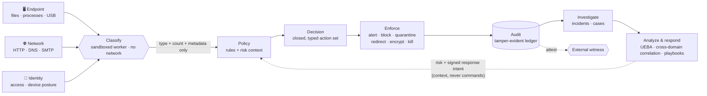
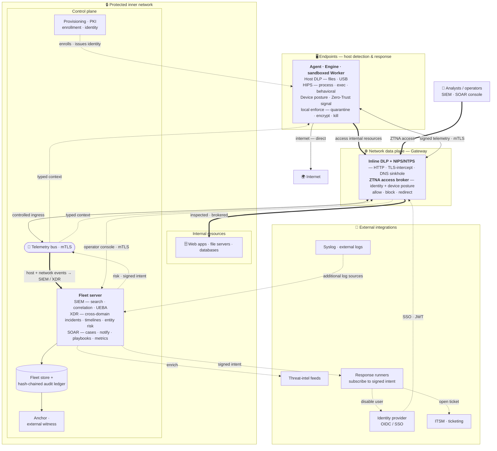

<div align="center">


<br/>

[](https://github.com/lucianoengel/openshield/actions/workflows/ci.yml)
[](https://goreportcard.com/report/github.com/lucianoengel/openshield)
[](go.mod)
[](LICENSE)
[](#-project-status)
[](#-components)

**One pipeline. Every layer. Tamper-evident by design.**

A pipeline-native **XDR + SOAR** data-security platform — DLP, HIPS, network prevention, SIEM,
and Zero-Trust access, unified by a single detection-and-response pipeline and a forward-secure,
externally anchored audit ledger that makes *every* decision independently verifiable.

[Capabilities](#-capabilities) · [Architecture](#-architecture) · [Quick start](#-quick-start) · [Roadmap](docs/architecture-roadmap.md) · [Threat model](docs/threat-model.md) · [Contributing](#-contributing)

</div>

---

> ### ⚠️ Project status — pre-alpha
>
> **What runs:** the full observe path, end-to-end, as binaries — a file dropped in a watched
> directory is classified in a sandboxed worker, evaluated against policy, and lands in the
> hash-chained ledger (`make integration`). The control plane, mutual-TLS transport, network gateway,
> HIPS pipeline, cross-domain correlation and SOAR orchestration are built and tested.
>
> **Inline prevention is real**, proven on a live kernel: an execution and a file **open** are both
> refused by the kernel on a verdict from the full pipeline. Both fail open by design — a gate that
> failed closed would hang every process on the host.
>
> **What pre-alpha still means:** no published release, single-node durability, **no analyst UI**, and
> it has never run in production anywhere. The table below names what is missing per domain, and
> [`unwired-audit.md`](docs/unwired-audit.md) is a running log of the times something looked finished
> and was not.

## 🔍 Overview

Most security suites bolt DLP, EDR, NDR and SIEM together as separate products with separate data
models. OpenShield is the opposite bet: **one fixed pipeline** absorbs every capability as a plugin,
so a network detector, an endpoint process rule and an identity signal all flow through the same
stages and land in the same tamper-evident evidence store.

```
Event → Classify → Policy → Decision → Enforce → Audit   ·   above it: Investigate · Analyze · Respond
```

New capability arrives as a **Producer** (event source), a **Classifier** (detector), a **Policy**
input, or — rarely and deliberately — **one new typed Action**. The core never changes. That
discipline is what lets one codebase span seven security domains instead of becoming seven products.

### Why OpenShield

| | |
|---|---|
| 🔗 **One pipeline, every domain** | Files, process exec, DNS, SMTP, USB and network flows are all just *Events*. Add a producer, reuse the whole stack. |
| 🛡️ **The control plane cannot actuate** | The `Action` set is closed, typed and **parameterless**. A compromised server can place a subject under containment; it can never express "run this command". |
| 🔒 **Content never leaves the sandbox** | Untrusted bytes are parsed in a seccomp-hardened worker with no network. Only type + count + metadata cross the boundary. |
| ⛓️ **Every decision is evidence** | A per-agent, forward-secure, hash-chained ledger with external anchoring — an independent witness the ledger writer cannot impersonate. The crown jewel. |
| 🧪 **Tests that can't lie to themselves** | Security properties are proven by re-introducing the bug (mutation testing) on live Postgres/NATS/TLS — not by mocks that share the code's assumptions. |
| 📖 **Honest by construction** | A CI guard fails the build on overclaiming language in this file. The gaps below are the point, not a footnote. |

## 🧭 Capabilities

> **Read the percentages carefully.** They are a **self-assessment against the scope this project set
> for itself** — not against a commercial product in that category. A domain at 80% here has the
> depth its own design called for; it does not have the integration catalogue, the console, or the
> years of field hardening a buyer is comparing it to.
> [`enterprise-gap-assessment.md`](docs/enterprise-gap-assessment.md) is the buyer's view of the same
> tree, and it is deliberately less flattering.
>
> The **"Not there yet"** column is the point of the table. The long form of every gap, with its
> reasoning, is in [`architecture-roadmap.md`](docs/architecture-roadmap.md).

| Domain | | What works today | Not there yet |
|---|:--:|---|---|
| 🖥️ **HIPS** | 🟢 85% | Inline exec **prevention** on a live kernel — deny-list, whitelist and default-deny, with the verdict from the full pipeline over a parser-free IPC bridge. FIM (baseline, real-time, signed, delete-aware), ransomware canaries with process attribution, memory-injection detection, critical-process guard with pid-reuse revalidation. A `CONTAIN` intent makes an entity's next exec kernel-refused. | No eBPF/LSM hooks. Memory scanning is **polled, not hooked** — injection done and undone between polls is never seen. The W+X JIT allowlist ships with **no built-in defaults**. Ransomware attribution is opportunistic and says so: it names suspects, not culprits. |
| 🔐 **Zero Trust** | 🟢 80% | Full hardware attestation chain (TPM quote → EK→AK activation → measured-boot PCR → continuous re-attestation), pre-auth enrolment tokens, DPoP-bound tokens, live JWKS, RBAC resolved server-side. A dual-credential access proxy pairs device with user identity; **CONNECT tunnels and a SOCKS5 listener** reach non-HTTP services, re-authorized on a clock. Split-horizon DNS and an endpoint bypass guard. | **SAML and JIT provisioning are absent**, and the SCIM subset has never been tested against a live IdP. The bypass guard is the *endpoint* half — root can remove its rules (D16). A tunnel is **brokered, not inspected**: its bytes are opaque. No continuous posture re-evaluation *inside* a long-lived tunnel. |
| 🤖 **SOAR** | 🟢 80% | Clock-driven correlation (leader-only), a forward-only attributed incident lifecycle, and a declarative **playbook engine** over a closed, non-actuating step registry that resumes across restarts without repeating a step. Signed threat-intel enrichment, response metrics (MTTA/MTTR, each with the population it excludes), severity/kind routing, an escalation ladder, and recurrence linking. Approved intents are enacted with four-eyes re-checked by the runner. | **Two integration runners** — an identity provider and a ticketing system. That is the honest distance from a commercial SOAR, which is measured in hundreds. No console. Escalation is a **timer, not a roster** — no rotation, no calendar. Reopening an incident stays refused by design, so MTTA/MTTR remain meaningful. |
| 🛡️ **Privacy** | 🟢 80% | Pseudonymous subjects and purpose tags by default; classification transmits **type, confidence and count** and never content or a reversible hash of low-entropy PII. Retention purge tombstones (the chain stays verifiable) and **refuses to erase what a legal hold covers**. Viewing an investigation is itself a ledger entry. DSAR export, a four-eyes gate before any HR-visible outcome, a DPIA template, and configurable **exclusions** applied before classification. | The exclusion's halves are **not equally complete and the product says which**: a time window always applies; a *path* exclusion needs resolved paths, and where the identity carries none the event is observed and **counted**, so the gap is a number rather than a silence. An exclusion suppresses observation, never an enforcement verdict. No per-user or per-group exclusions — there is no directory integration. |
| 🧬 **XDR** | 🟢 75% | An entity graph populated by real producers (device⋈user) and an alert stream fed by **every** domain. Cross-domain correlation over distinct-domain windows, ordered domain sequences, **and ordered MITRE ATT&CK technique sequences** — run on a clock from a validated hunt file, so a narrative pages a human rather than only answering someone who already suspected it. Incident timelines link each alert to evidence with an explicit resolved/unresolved/derived state. | **No analyst UI** — the CLI and API are the interface, and this is the single largest gap in the product. No retro-correlation outside the window, and no alert-storm suppression. A technique sequence needs one alert per step, so a chain inside a single event is not expressible as one. |
| 🗂️ **DLP** | 🟢 75% | Exact-data matching (single and multi-cell), document fingerprinting, exfil-channel awareness, keyword proximity and **26 detector types** including national IDs — all boundary-honoured, over signed indexes, with recursive archive extraction. Content-aware CASB. Clipboard is **mediated** on X11 (the engine owns the selection and decides each paste by destination); print jobs are aborted inside the CUPS filter chain. Data-at-rest discovery reports **who can read it**, three-valued. | **No OCR** — a screenshot is recognised *as* a capture, but its text is never read, and only full-screen captures are recognised. Wayland clipboard stays observe-only: its protocol cannot identify a paste's destination. Data-at-rest reads bucket-level ACL and policy only — per-object ACLs and IAM identity-based grants are invisible, and there is no remediation. |
| 🌐 **NIPS / NTPS** | 🟢 75% | Transparent TPROXY drops and splices L4 by destination, SNI or payload, self-installing and self-healing its rules. Threat-intel IOC and content-signature engines, both hot-reloading from file or URL. **JA3 fingerprinting** as a first-class indicator — the axis that still says something when a domain is new, rotated or encrypted away. HTTP/1.1, **HTTP/2 and QUIC** are intercepted through the same pipeline. DNS sinkhole with transparent `:53` redirect and a bypass watchdog. SMTP is **filtered**, not merely inspected. | **No Suricata grammar** — the IOC feed is a flat `<kind> <indicator>` format, not a rule language. A JA3 match is reported *below* a destination indicator on purpose: it identifies a TLS library at a version, shared by every program built on it, so it is evidence and not proof. |
| 📊 **SIEM** | 🟡 70% | Unified alert lifecycle (severity, status, dedup, ATT&CK mapping, durable notification dedup). External-log ingest across **CEF, LEEF, syslog, AWS CloudTrail, Windows Event Forwarding, native Sysmon and newline-delimited JSON**, nested objects flattened to huntable keys. A **cross-vendor vocabulary** reaches `suser`, `userIdentityArn`, `SubjectUserName` and `user.name` in one query — applied on read, and enumerable over the API, so "no results" reads as *not covered here* rather than *did not happen*. Saved searches validated at save time. | **No console** — search is an API. Retention and index management are basic next to a mature SIEM. A JSON source whose timestamp field the map does not recognise is stamped at ingest — counted, but **on the timeline in the wrong place**, where a time-bounded hunt misses it and reports clean. **UEBA is the weakest thing the diagrams name** (~30%): peer-relative *count* deviation against a one-number-per-subject baseline, with no warm-up gate, no decay, no seasonality and no multi-feature profile. It stays statistical by decision — a model score is not reproducible, and `openshieldctl replay` would stop meaning anything. |

<sub>⛓️ **Crown jewel:** the forward-secure hash-chained ledger with external anchoring — every domain
above writes evidence into it, and it is the one component the rest of the product is built to feed.</sub>

## 🏗️ Architecture

Endpoint, network and identity telemetry all flow through the same stages. Detection and enforcement
are kept strictly separate: an enforcer receives only a *decision*, never which detector matched or why.


```mermaid
flowchart LR
  EP["🖥️ Endpoint<br/>files · processes · USB"] --> C
  NW["🌐 Network<br/>HTTP · DNS · SMTP"] --> C
  ID["🔐 Identity<br/>access · device posture"] --> C
  C{{"Classify<br/>sandboxed worker · no network"}} -->|"type + count + metadata only"| POL["Policy<br/>rules + risk context"]
  POL --> DEC["Decision<br/>closed, typed action set"]
  DEC --> ENF["Enforce<br/>alert · block · quarantine<br/>redirect · encrypt · kill"]
  ENF --> LED[("Audit<br/>tamper-evident ledger")]
  LED --> INC["Investigate<br/>incidents · cases"]
  INC --> RSP["Analyze &amp; respond<br/>UEBA · cross-domain correlation · playbooks"]
  RSP -.->|"risk + signed response intent<br/>(context, never commands)"| POL
  LED -.->|attest| WIT{{"External witness"}}
```

**Three tiers, one pipeline, one ledger.** Detection and response run on the **host** (file DLP, HIPS,
device posture, local enforcement, DNS and SMTP inspection), at the **network gateway** (inline DLP as
NIPS over HTTP/1.1, HTTP/2 and QUIC, the DNS sinkhole, ZTNA brokering), and in the **control plane**
(SIEM correlation, XDR incidents, SOAR response). Host and gateway stream **signed** events inward;
the control plane feeds risk and coordinated-response context back out as context, never as commands.

<details>
<summary><b>Deployment topology</b> — click to expand</summary>


```mermaid
flowchart TB
  INET["🌍 Internet"]

  subgraph EP["🖥️ Endpoints — host detection &amp; response"]
    HOST["<b>Agent · Engine · sandboxed Worker</b><br/>Host DLP — files · USB<br/>HIPS — process · exec · behavioral<br/>Device posture · Zero-Trust signal<br/>local enforce — quarantine · encrypt · kill"]
  end

  subgraph NETP["🌐 Network data plane — Gateway"]
    GW["<b>Inline DLP + NIPS/NTPS</b> — HTTP · TLS-intercept · DNS sinkhole<br/><b>ZTNA access broker</b> — identity + device posture<br/>allow · block · redirect"]
  end

  subgraph INNER["🔒 Protected inner network"]
    subgraph RES["Internal resources"]
      APPS["🗄️ Web apps · file servers · databases"]
    end
    subgraph CP["Control plane"]
      BUS(["📨 Telemetry bus · mTLS"])
      SRV["<b>Fleet server</b><br/>SIEM — search · correlation · UEBA<br/>XDR — cross-domain incidents · timelines · entity risk<br/>SOAR — cases · notify · playbooks · metrics"]
      LED[("Fleet store +<br/>hash-chained audit ledger")]
      PKI["Provisioning · PKI<br/>enrollment · identity"]
      ANC["Anchor ·<br/>external witness"]
    end
  end

  OPS["👤 Analysts / operators<br/>SIEM · SOAR console"]

  subgraph EXT["🔌 External integrations"]
    IDP["Identity provider<br/>OIDC / SSO"]
    ITSM["ITSM · ticketing"]
    TI["Threat-intel feeds"]
    LOGS["Syslog · external logs"]
    RUN["Response runners<br/>subscribe to signed intent"]
  end

  HOST -->|"internet — direct"| INET
  HOST ==>|"access internal resources"| GW
  GW ==>|"inspected · brokered"| APPS
  OPS ==>|"ZTNA access"| GW

  HOST <-->|"signed telemetry · mTLS"| GW
  GW <-->|"controlled ingress"| BUS
  BUS ==>|"host + network events → SIEM / XDR"| SRV
  SRV --> LED --> ANC
  GW -.->|"operator console · mTLS"| SRV

  PKI -.->|"enrolls · issues identity"| HOST
  IDP -.->|"SSO · JWT"| GW
  LOGS -.->|"additional log sources"| SRV

  SRV -.->|"risk · signed intent"| BUS
  BUS -.->|"typed context"| HOST
  BUS -.->|"typed context"| GW
  SRV -.->|"enrich"| TI
  SRV -.->|"signed intent"| RUN
  RUN -.->|"disable user"| IDP
  RUN -.->|"open ticket"| ITSM
```

<sub><i>The gateway is the network boundary into the protected zone. Dashed edges are the
coordinated-response path — signed risk and response intent flowing back to enforcement points as
context, never as commands. Users reach internal apps through the gateway: web apps inspected,
non-HTTP services brokered by CONNECT tunnel or SOCKS5 on identity, posture and risk — brokered,
**not** inspected, because their bytes are opaque. Every box shown is built and tested; there is no
analyst UI over any of it.</i></sub>

</details>

## 🧩 Components

Thirteen focused, single-responsibility binaries, all Go, under [`cmd/`](cmd):

| Binary | Role |
|---|---|
| **`openshield-engine`** | The endpoint pipeline. Unprivileged, network-capable: watches directories via notify-mode fanotify, ingests DNS and SMTP, classifies via the worker, evaluates policy, decides, appends to the ledger. |
| **`openshield-worker`** | The seccomp-hardened parser. Opens files with its own credentials and classifies untrusted bytes — no network, no secrets. |
| **`openshield-agent`** | The privileged inline-enforcement agent (fanotify **permission** mode, `CAP_SYS_ADMIN`). Refuses an execution or a file open on a pipeline verdict. Each gate is enabled separately; both fail open. |
| **`openshield-gateway`** | The network data plane. TLS-intercepting proxy (inline DLP), ZTNA access broker, DNS sinkhole — each request classified in the sandboxed worker. |
| **`openshield-server`** | The fleet control plane. Ingests signed telemetry over NATS, persists the fleet aggregate, runs correlation, incidents and alert delivery. It coordinates and observes; it does not control. |
| **`openshield-fleet-agent`** | The fleet-facing endpoint half: generates a per-agent identity, enrolls, publishes signed telemetry, heartbeats and device posture. |
| **`openshield-provision`** | Issues enrolment tokens, client certificates, and the witness/posture/risk keypairs. Minimal provisioning for dev and small fleets — not a full PKI. |
| **`openshield-anchor`** | Witnesses the ledger head and stores an external anchor. It attests; it cannot append. |
| **`openshieldctl`** | The operator CLI: incident timelines, ledger verification, the backup/restore drill (a restore is not finished until the ledger re-verifies), and signed release build/verify. |
| **`openshield-dlp-index`** | Builds and **signs** the EDM and fingerprint indexes. An index whose signature fails stops the worker rather than silently matching nothing. |
| **`openshield-fim-baseline`** | Produces the signed known-good manifest FIM compares against. |
| **`openshield-ztna-client`** | The endpoint half of Zero-Trust access, via the ordinary `HTTP_PROXY` convention. Loopback-only, no root. It **brokers** access; it does not stop an application taking a direct route. |
| **`openshield-print-filter`** | The CUPS filter-chain half of print DLP. A non-zero exit aborts the job. It parses nothing, and fails open if the engine is unreachable. |

## 🚀 Quick start

**Requirements:** Go **1.26+**, Linux (fanotify), PostgreSQL, NATS. Containers use **Podman**.

```bash
git clone https://github.com/lucianoengel/openshield.git
cd openshield

make build        # compile the binaries under cmd/
make quick        # the fast loop: vet, cross-compile, doc + boundary guards
make integration  # see the observe path run end-to-end against live Postgres + NATS
make all          # the full gate: everything above plus tests with -race. Not quick.
```

`make integration` is the one to run first — drop a real file in a watched directory and watch it
land an `ALERT` in the forward-secure ledger.

### Configuration

Typed and two-tier. **Bootstrap** settings — what a process needs before it can reach anything — come
from the environment: `OPENSHIELD_DSN`, `OPENSHIELD_WATCH_DIRS`, `OPENSHIELD_ENFORCE` (opt in to
enforcement; **observe-only by default**). **Dynamic** settings are database-authoritative and change
without a restart, and the environment does not override them, so a value an operator sets cannot be
silently countermanded by a stale unit file.

Every setting declares a kind, and a malformed value is refused when it is set rather than falling
back to a default — a typo that quietly disables a detector is the failure this exists to prevent.
Ask a running deployment what it is actually using with `openshield-server config`, which reads the
database rather than reprinting the defaults. See [`deploy/`](deploy) for compose and systemd examples.

## 🗺️ What's next

**The analyst UI.** It was deliberately last, so it would be built over a proven backend rather than
alongside one. That condition is met, and it is now the single largest gap in the product — every
capability above is driven by a CLI and an API. It is designed for investigation ergonomics — pivot,
search, replay, and *explain a decision* — not for display.

Then, in rough order of value:

- **🔍 Endpoint depth** — eBPF/LSM hooks, to replace polled memory scanning with hooked.
- **🌐 Network depth** — a Suricata-compatible rule grammar, so operators can bring rules they already have.
- **🤖 Integration breadth** — the honest distance from a commercial SOAR is the runner catalogue, not the engine.
- **🖥️ Cross-platform agents** (Windows / macOS) — the observe path already compiles and runs off Linux; enforcement stays gated on platform certificates and entitlements.
- **🔎 Detection breadth** — OCR, cropped-window screenshot recognition, Italy's Codice Fiscale.
- **📦 Distribution** — Sigstore/cosign with a transparency log, `.rpm`, macOS notarization.

Two of those are **decisions rather than work**, and are stated that way on purpose. **OCR**: every
general engine is a native image parser — the exact class the privilege split exists to contain — so
the route worth taking is ONNX detection+recognition over Go's own memory-safe image decoders, which
removes the C parser instead of sandboxing it. **Italy's Codice Fiscale** is absent rather than
guessed: its check letter comes from two 36-entry tables, and the tables reconstructible here matched
exactly one published worked example, which cannot rule out a single wrong entry — and a wrong entry
misclassifies a narrow, unpredictable slice of real identifiers forever.

<sub>The engineering plan, the per-ticket residuals and the decision records live in
[`docs/architecture-roadmap.md`](docs/architecture-roadmap.md).</sub>

## 🔐 Security model

The guarantees come from a small set of deliberate, documented constraints:

- **Closed, typed action set.** The control plane can never express an arbitrary command; actions
  carry no free-form parameters. This is what makes *"the server coordinates, it does not control"*
  architectural rather than aspirational.
- **Content isolation.** Sensitive content is parsed only inside a sandboxed, network-less worker.
  Only type, count and metadata cross the boundary.
- **Observe by default.** Enforcement is opt-in; out of the box the platform detects and audits.
- **Deliberate egress fail-open.** Inline network paths fail *to wire*, never fail the network closed
  — availability is a conscious, documented choice for egress.
- **Tamper-evident evidence.** The forward-secure, hash-chained ledger with external anchoring can be
  independently verified rather than merely trusted.

**What OpenShield does not claim:** it is detection and friction, not prevention; it is not effective
against an attacker with root on the endpoint; and the ledger is tamper-*evident*, not immutable.
The [threat model](docs/threat-model.md) states each of the eight trust boundaries with its guard,
its proof, and its limit.

## 📚 Documentation

| Doc | What's in it |
|---|---|
| [Architecture roadmap](docs/architecture-roadmap.md) | Live capability status, the plan, and the architecture-decision records |
| [Design decisions](docs/decisions.md) | The architectural decision register behind the codebase |
| [Invariants](INVARIANTS.md) | The load-bearing security properties, each naming the test that fails when it regresses |
| [Threat model](docs/threat-model.md) | Assets, adversaries, and eight trust boundaries — each with its guard, proof and limit |
| [Enterprise gap assessment](docs/enterprise-gap-assessment.md) | The same tree measured from the **buyer's** side, against a commercial stack |
| [Unwired-feature audit](docs/unwired-audit.md) | A running log of code that was built, tested, and reachable by nothing |
| [Operator runbook](docs/runbook.md) | Deployment footprint, costs, backup drills, verification, recovery |
| [DPIA template](docs/dpia-template.md) | Data-protection impact assessment scaffold |
| [Changelog](CHANGELOG.md) | The milestone arc in build order |
| [Contributing](CONTRIBUTING.md) | House rules, the testing discipline, and how capability is expected to land |

## 🤝 Contributing

Contributions are welcome. A few house rules that keep the project honest:

- **Keep pull requests focused** — one self-contained change at a time.
- **Tests must drive the real runtime path**, never a mock built from the code's own assumptions. For
  every security property, add an adversarial test that re-introduces the bug and proves the test
  catches it.
- **Respect the stable core.** New capability lands as an event source, detector, policy input or
  action — not as a change to the core pipeline.
- Run `make all` before opening a PR; `make quick` is the loop in between.

Use [conventional commits](https://www.conventionalcommits.org/) (`feat:`, `fix:`, `refactor:`, …).

## 📄 License

[Apache 2.0](LICENSE).
