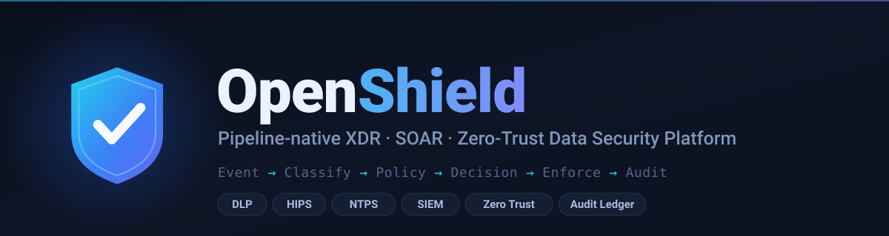
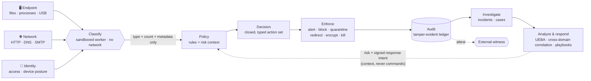

<div align="center">



<br/>

[](https://github.com/lucianoengel/openshield/actions/workflows/ci.yml)
[](https://goreportcard.com/report/github.com/lucianoengel/openshield)
[](go.mod)
[](LICENSE)
[](#-project-status)
[](#-components)

**One pipeline. Every layer. Tamper-evident by design.**

A pipeline-native **XDR + SOAR** data-security platform — DLP, HIPS, network prevention, SIEM,
and Zero-Trust access, unified by a single detection-and-response pipeline and a forward-secure,
externally anchored audit ledger that makes *every* decision independently verifiable.

[Roadmap](docs/architecture-roadmap.md) · [Architecture](#-architecture) · [Decisions](docs/decisions.md) · [Threat model](docs/threat-model.md) · [Contributing](#-contributing)

</div>

---

> ### ⚠️ Project status
> **OpenShield is pre-alpha.** The **observe path runs end-to-end as a binary** — a real file
> dropped in a watched directory is classified in a sandboxed worker, evaluated against policy, and
> lands an `ALERT` in the hash-chained ledger (the integration suite, `make integration`). A fleet
> control plane, mutual-TLS transport, network gateway, HIPS process pipeline, cross-domain
> correlation and SOAR orchestration are built and tested.
>
> **Inline prevention is real** and proven on a live kernel: an execution is refused by the kernel on a
> verdict from the full pipeline, and so now is a file **open** — decided from a bounded prefix the
> agent reads from the kernel's own descriptor, so the gate never re-opens the file it is deciding
> about, and then classified in **full** by the asynchronous tier afterwards, so content past the
> inline ceiling is still detected and recorded. Both fail open by design: a gate that failed closed
> would hang every process on the host.
>
> **What "pre-alpha" still means here:** there is no published release (the signing, SBOM and
> verification tooling exists; nothing has been cut with it), durability is single-node, there is
> **no analyst UI**, and nothing here has run in production anywhere. The maturity table below names
> what is missing per domain, and the [unwired-feature audit](docs/unwired-audit.md) is a running log
> of the times something looked finished and was not.

## 🔍 Overview

Most security suites bolt DLP, EDR, NDR, and SIEM together as separate products with separate
data models. OpenShield is the opposite bet: **one fixed pipeline** absorbs every capability as a
plugin, so a network detector, an endpoint process rule, and an identity signal all flow through
the same stages and land in the same tamper-evident evidence store.

```
Event → Classify → Policy → Decision → Enforce → Audit     ·     (above the pipeline) Investigate · Analyze · Respond
```

New capability arrives as a new **Producer** (event source), **Classifier** (detector),
**Policy** input, or — rarely and deliberately — **one new typed Action**. The core never changes.
That discipline is what lets OpenShield span seven security domains without becoming seven codebases.

## ✨ Why OpenShield

- **🔗 One pipeline, every domain.** Endpoint files, process exec, DNS, SMTP, USB, and network flows
  are all just *Events*. Add a producer, reuse the whole stack.
- **🛡️ The control plane cannot actuate.** The `Action` set is **closed, typed, and
  parameterless** — a compromised server can place a subject under containment, but can never
  express "run this command." Enforcement decisions are made *locally*; the server coordinates, it
  does not control.
- **🔒 Content never leaves the sandbox.** Untrusted bytes are parsed in a seccomp-hardened worker
  with no network; only **type + count + metadata** cross the boundary — never the sensitive content
  itself.
- **⛓️ Every decision is evidence.** A per-agent, forward-secure, hash-chained ledger with external
  anchoring makes the audit trail tamper-evident — an independent witness the ledger writer cannot
  impersonate. This is the platform's crown jewel.
- **🧪 Tests that can't lie to themselves.** Security properties are proven by re-introducing the
  bug (mutation testing) on live Postgres/NATS/TLS, not by mocks that share the code's assumptions.
- **📖 Honest by construction.** The docs say what runs, what's deferred, and what's still a claim.

## 🧭 Capabilities

OpenShield is architected as a **pipeline-native XDR + SOAR**, with each domain a detection lens over
the shared pipeline. Maturity is tracked candidly, and the *"what is not there yet"* column is the
point of the table rather than a footnote — percentages flatter, and a named gap does not.

The per-domain detection planes are broadly real and deep in several domains. What remains is
**operator surface**: everything below is driven by a CLI and an API, and the analyst UI is
deliberately last, after the platform it would display is built and tested.

| Domain | Maturity | What works today | What is not there yet |
|---|:---:|---|---|
| 🧬 **XDR** (umbrella) | 🟢 ~80% | Entity graph wired and populated by real producers (device⋈user); an entity-keyed alert stream fed by **every** domain; cross-domain correlation (distinct-domain window, ordered domain-sequence **and ordered MITRE ATT&CK technique-sequence** rules — `T1552 → T1567.002` — over technique ids the platform *derived* from its own signals and the Decision contract refuses if forged) materialised per entity and paging once; incident **timelines** carrying contributing alerts in detection order, each linked to evidence with an explicit resolved/unresolved/derived state; coordinated cross-domain response; per-entity risk aggregation. | Reading a timeline is view-audited, but there is no analyst UI to read it *in* — the CLI and API are the interface. A technique sequence needs one alert per step, so a chain that happens entirely within a single event is not expressible as one. |
| 🔐 **Zero Trust (ZTNA)** | 🟢 ~90% | Full hardware attestation chain (TPM quote → EK→AK activation → measured-boot PCR → continuous re-attestation), EK-cert anchoring, pre-auth enrolment tokens, DPoP-bound tokens, live JWKS refresh, RBAC tiers, and a dual-credential access proxy pairing device identity with user identity. **CONNECT tunnels** reach catalogued non-HTTP services (databases, SSH) on the same authenticated connection, re-authorized on a clock so a session that loses access is torn down mid-flight. An **endpoint bypass guard** rejects traffic to protected ranges except through the gateway, in both address families, and counts the attempts. | The bypass guard is the **endpoint half**: the network half — the protected network accepting only the gateway — lives in the network, and root on an endpoint can remove the rules (D16). A tunnel is **brokered, not inspected**: its bytes are opaque. No SOCKS5 (it carries no place for a client certificate or a bearer token, so it needs its own authentication design, not a switch) and no split DNS. |
| 🗂️ **DLP** | 🟢 ~78% | Exact-data matching (single and multi-cell), document fingerprinting, exfil-channel awareness, keyword proximity, national IDs — all boundary-honoured, over signed indexes, with recursive archive extraction. Content-aware CASB blocks sensitive uploads to unsanctioned clouds. Clipboard is **mediated** on X11 (the engine owns the selection and decides each paste by destination); print jobs are aborted in the CUPS filter chain before they print. | Wayland clipboard stays observe-only — its protocol cannot identify a paste's destination. **No OCR** — a screenshot is now recognised AS a screen capture (exact display resolution plus the flat palette of rendered content), so policy can act on one leaving, but the text in it is never read. Only FULL-SCREEN captures are recognised; a window crop is not, because flatness alone is what charts and logos look like. |
| 🌐 **NIPS / NTPS** | 🟡 ~72% | Transparent TPROXY drops and splices L4 by destination IP, SNI or payload, and self-installs and self-heals its rules. Threat-intel IOC engine and content-signature engine, both hot-reloading from a local file or a remote URL. **JA3 client fingerprinting** is a first-class indicator kind — the one axis that still says something when the domain is new, rotated or encrypted away — matched on the transparent plane *and* on blind CONNECT tunnels, the flow the product had conceded it cannot read. **HTTP/2 is intercepted** through the same pipeline as HTTP/1.1. DNS preventive sinkhole with a transparent `:53` redirect and a bypass watchdog. Live DNS-query and SMTP-message inspection into the pipeline, including DNS-tunnelling scoring — and SMTP is now **filtered**, not only inspected: the reply to the final `.` of DATA is the only moment a message can be refused, and it is. | No full Suricata grammar. No QUIC — it is UDP and needs a different data path, not a different ALPN string. A JA3 match is reported *below* a destination indicator on purpose: it identifies a TLS library at a version, shared by every program built on it, so it is evidence and not proof. |
| 📊 **SIEM** | 🟡 ~68% | Unified alert lifecycle (severity, status, dedup, ATT&CK mapping, durable notification dedup, pruned baselines). External-log ingest is live — CEF-over-syslog (UDP **and** reliable TCP/mutual-TLS), AWS CloudTrail, Windows Event Forwarding XML, and **newline-delimited JSON** (what application logs, Kubernetes, GCP audit and Azure activity all emit), nested objects flattened to huntable keys. A **cross-vendor vocabulary** means one query reaches `suser`, `userIdentityArn`, `SubjectUserName` and `user.name` at once — applied on read, so improving the map improves every log ever ingested — and it is enumerable over the API, so "no results" can be read as *not covered here* rather than *did not happen*. **Saved searches** are validated by the surface's own parser at save time and runnable by the whole team. | Still narrower than a mature SIEM's format list (no LEEF, no native Sysmon schema). A JSON source whose timestamp field the map does not recognise has its events stamped at ingest — **counted, but on the timeline in the wrong place** until the map learns the field, where a time-bounded hunt misses them and reports clean. |
| 🖥️ **HIPS** | 🟢 ~88% | Inline exec **prevention** on a live kernel: static deny-list/whitelist plus default-deny whitelisting, with the verdict coming from the **full pipeline** over a parser-free IPC bridge. FIM (baseline, real-time, signed, delete-aware), ransomware canaries, memory-injection detection, a trusted-identity critical-process guard with pid-reuse revalidation. A ransomware detection now **names the processes** holding the affected tree open, each with the start time a kill revalidates against so it cannot land on a recycled pid. A `CONTAIN` response-intent makes an entity's next exec kernel-refused. | No eBPF/LSM real-time hooks. W+X memory scanning now has a JIT allowlist, so the detector survives contact with a machine that runs a browser — but it is an operator-supplied list of executables with **no built-in defaults**, and it suppresses only *anonymous* regions of a listed, still-present binary. Scanning is **polled**, not hooked: injection that happens and is undone between polls is never seen. Ransomware attribution is **opportunistic and says so**: a process that closed its descriptors before the scan is invisible, seeing another user's processes needs `CAP_SYS_PTRACE`, and a scan that could not look reports itself blind rather than clean. It names suspects, not culprits. |
| 🤖 **SOAR** | 🟢 ~97% | Correlation runs on a clock (leader-only). Incidents carry a forward-only attributed lifecycle. A declarative **playbook engine** over a closed, non-actuating step registry runs first response automatically and resumes across a restart without repeating a step. Signed threat-intel feed ingest enriches incidents from observables the verified events already carry. Response time is measured (detection latency, MTTA, MTTR) — each reported with the population it excludes. Notifications route by kind and severity to named sinks, and an **escalation ladder** pages elsewhere when nobody answers — acknowledging an incident stops it, and each rung is claimed durably so a restart does not re-fire it. Trouble that **returns after a close** is linked to what it recurred from, counted, and announced as a recurrence on the page. Correlation can be **replayed** over a historical window that was missed while nothing was correlating, without paging and without skewing the response metrics. Approved intents are enacted against an external identity provider with four-eyes re-checked by the runner, and incidents sync bidirectionally with a ticketing system. | Escalation is a **timer, not a schedule**: no rotation, no calendar, no on-call roster — that needs a roster this product does not have, and a half-built one that pages the wrong person is worse than none. Reopening an incident stays **refused by design** so MTTA/MTTR remain meaningful; recurrence is metadata about a sequence of incidents, not a way to resurrect one. |

<sub>⛓️ **Crown jewel:** the forward-secure hash-chained ledger + external anchoring is real,
end-to-end, and the strongest asset — every domain above writes evidence into it.</sub>

## 🏗️ Architecture

**One pipeline, every signal.** Endpoint, network, and identity telemetry all flow through the same
stages. Detection and enforcement are kept strictly separate — an enforcer receives only a
*decision*, never which detector matched or why:


```mermaid
flowchart LR
  EP["🖥️ Endpoint<br/>files · processes · USB"] --> C
  NW["🌐 Network<br/>HTTP · DNS · SMTP"] --> C
  ID["🔐 Identity<br/>access · device posture"] --> C
  C{{"Classify<br/>sandboxed worker · no network"}} -->|"type + count + metadata only"| POL["Policy<br/>rules + risk context"]
  POL --> DEC["Decision<br/>closed, typed action set"]
  DEC --> ENF["Enforce<br/>alert · block · quarantine<br/>redirect · encrypt · kill"]
  ENF --> LED[("Audit<br/>tamper-evident ledger")]
  LED --> INC["Investigate<br/>incidents · cases"]
  INC --> RSP["Analyze &amp; respond<br/>UEBA · cross-domain correlation · playbooks"]
  RSP -.->|"risk + signed response intent<br/>(context, never commands)"| POL
  LED -.->|attest| WIT{{"External witness"}}
```

**A stable core, plug-in capability.** The pipeline's core — the dispatcher, the stages, the enforcer
contracts, and the ledger — stays fixed. New capability lands as a new event source, a new detector,
a new policy input, or one deliberate new action, never as a change to the core. That discipline is
what lets a single codebase span seven security domains instead of fragmenting into seven products.

**The full picture** — OpenShield runs detection-and-response at **three tiers that share one pipeline
and one evidence ledger**: on the **host** (file DLP, HIPS process control, device posture, local
enforcement, plus DNS-query inspection and SMTP filtering), at the **network gateway** (inline DLP *as*
NIPS over HTTP and HTTP/2, the DNS sinkhole, plus ZTNA access brokering), and in the **control plane**
(SIEM correlation, XDR cross-domain incidents, SOAR response).
Users reach internal apps, file servers, and databases *through* the gateway — web apps inspected, and
non-HTTP services brokered by CONNECT tunnel (brokered on identity, posture and risk; **not** inspected,
because their bytes are opaque to the gateway).
The **host agent's monitoring and the gateway's network detections stream as signed events** into the
control plane, where SIEM/XDR correlate them (with external syslog as an additional feed); and the
control plane feeds risk and coordinated-response context back out to every enforcement point.


```mermaid
flowchart TB
  INET["🌍 Internet"]

  subgraph EP["🖥️ Endpoints — host detection &amp; response"]
    HOST["<b>Agent · Engine · sandboxed Worker</b><br/>Host DLP — files · USB<br/>HIPS — process · exec · behavioral<br/>Device posture · Zero-Trust signal<br/>local enforce — quarantine · encrypt · kill"]
  end

  subgraph NETP["🌐 Network data plane — Gateway"]
    GW["<b>Inline DLP + NIPS/NTPS</b> — HTTP · TLS-intercept · DNS sinkhole<br/><b>ZTNA access broker</b> — identity + device posture<br/>allow · block · redirect"]
  end

  subgraph INNER["🔒 Protected inner network"]
    subgraph RES["Internal resources"]
      APPS["🗄️ Web apps · file servers · databases"]
    end
    subgraph CP["Control plane"]
      BUS(["📨 Telemetry bus · mTLS"])
      SRV["<b>Fleet server</b><br/>SIEM — search · correlation · UEBA<br/>XDR — cross-domain incidents · timelines · entity risk<br/>SOAR — cases · notify · playbooks · metrics"]
      LED[("Fleet store +<br/>hash-chained audit ledger")]
      PKI["Provisioning · PKI<br/>enrollment · identity"]
      ANC["Anchor ·<br/>external witness"]
    end
  end

  OPS["👤 Analysts / operators<br/>SIEM · SOAR console"]

  subgraph EXT["🔌 External integrations"]
    IDP["Identity provider<br/>OIDC / SSO"]
    ITSM["ITSM · ticketing"]
    TI["Threat-intel feeds"]
    LOGS["Syslog · external logs"]
    RUN["Response runners<br/>subscribe to signed intent"]
  end

  %% data plane — user access
  HOST -->|"internet — direct"| INET
  HOST ==>|"access internal resources"| GW
  GW ==>|"inspected · brokered"| APPS
  OPS ==>|"ZTNA access"| GW

  %% management plane — signed events into the inner network (the SIEM/XDR feed)
  HOST <-->|"signed telemetry · mTLS"| GW
  GW <-->|"controlled ingress"| BUS
  BUS ==>|"host + network events → SIEM / XDR"| SRV
  SRV --> LED --> ANC
  GW -.->|"operator console · mTLS"| SRV

  %% identity / zero trust
  PKI -.->|"enrolls · issues identity"| HOST
  IDP -.->|"SSO · JWT"| GW
  LOGS -.->|"additional log sources"| SRV

  %% coordinated response — risk + signed response-intent back to every enforcement point
  SRV -.->|"risk · signed intent"| BUS
  BUS -.->|"typed context"| HOST
  BUS -.->|"typed context"| GW
  SRV -.->|"enrich"| TI
  SRV -.->|"signed intent"| RUN
  RUN -.->|"disable user"| IDP
  RUN -.->|"open ticket"| ITSM
```

<sub><i>Deployment topology. The gateway is the network boundary into the protected zone; dashed
edges are the coordinated-response path — signed risk and response intent flowing back to enforcement
points as context, never as commands. Every box shown is built and tested; the capability table above
names what is missing inside each one, and there is no analyst UI over any of it yet.</i></sub>

## 🧩 Components

OpenShield ships as focused, single-responsibility binaries (all Go, `cmd/`):

| Binary | Role |
|---|---|
| **`openshield-engine`** | The endpoint pipeline. Unprivileged, network-capable; watches directories via notify-mode fanotify, ingests DNS queries and SMTP messages, classifies via the worker, evaluates policy, decides, and appends to the ledger. |
| **`openshield-worker`** | The unprivileged, seccomp-hardened parser. Reads classify requests, opens files with its own credentials, classifies untrusted bytes — holds no network and no secrets. |
| **`openshield-gateway`** | The network data plane. TLS-intercepting proxy (inline DLP), ZTNA access broker, and the DNS sinkhole — each request classified in the sandboxed worker. |
| **`openshield-server`** | The fleet control plane. Ingests signed telemetry over NATS, persists the fleet aggregate, runs correlation/incidents and alert delivery. It coordinates and observes; it does not control. |
| **`openshield-fleet-agent`** | The fleet-facing endpoint half: generates a per-agent identity, enrolls, and publishes signed telemetry, heartbeats, and device posture. |
| **`openshield-agent`** | The privileged inline-enforcement agent (fanotify **permission** mode). Needs `CAP_SYS_ADMIN`. It refuses an **execution** inline — statically, or on a verdict from the engine's full pipeline — and refuses a file **open** on a verdict decided from a bounded prefix, which the engine then classifies in full asynchronously. Each gate is enabled separately; both fail open. |
| **`openshield-provision`** | Issues the credentials the stack needs — enrolment tokens, client certificates, and the witness, posture and risk keypairs. Minimal provisioning for dev and small fleets — not a full PKI. |
| **`openshield-anchor`** | Witnesses the audit-ledger head and stores an external anchor. It attests to the head; it cannot append — a witness the ledger writer cannot impersonate. |
| **`openshieldctl`** | The operator CLI: query the ledger as an incident timeline, verify it (with an external witness for completeness), run the **backup and restore drill** — a restore is not finished until the ledger re-verifies — and build or verify a **signed release** against a pinned key. |
| **`openshield-dlp-index`** | Builds and **signs** the exact-data-matching and document-fingerprint indexes the worker loads. An index whose signature does not verify stops the worker rather than silently matching nothing. |
| **`openshield-fim-baseline`** | Produces the signed known-good manifest file-integrity monitoring compares against. |
| **`openshield-ztna-client`** | The endpoint half of Zero-Trust access. Applications point at it with the ordinary `HTTP_PROXY` convention and it presents the **device's** certificate to the access proxy, so a connection is authorized by device identity. Loopback-only, no root. It **brokers** access — it does not prevent an application from taking a direct route. |
| **`openshield-print-filter`** | The CUPS filter-chain half of print DLP. A non-zero exit aborts the job, so it is prevention — and it parses nothing: the job is classified in the sandboxed worker, and it **fails open** if the engine is unreachable. |

## 🚀 Getting started

**Requirements:** Go **1.26+**, Linux (fanotify), PostgreSQL, and NATS. Containers use **Podman**.

```bash
# Clone
git clone https://github.com/lucianoengel/openshield.git
cd openshield

# Build + verify everything: vet, tests (with -race), doc/claim checks, binaries,
# cross-compilation, and the integration suite against live Postgres and NATS.
# It is the full gate and it is not quick.
make all

# The fast loop while iterating
make quick

# Or just compile the binaries under cmd/
make build
```

**See the observe path run end-to-end** — drop a real file in a watched directory and watch it land
an `ALERT` in the forward-secure ledger:

```bash
make integration
```

Configuration is **typed and two-tier**. *Bootstrap* settings — the ones a process needs before it can
reach anything — come from the environment: `OPENSHIELD_DSN` (Postgres), `OPENSHIELD_WATCH_DIRS`
(directories the engine observes), `OPENSHIELD_ENFORCE` (opt in to post-decision enforcement;
**observe-only by default**). *Dynamic* settings are **database-authoritative** and change without a
restart; the environment does not override them, so a value an operator sets cannot be silently
countermanded by a stale unit file.

Every setting declares a kind, and a malformed value is refused when it is set rather than falling back
to a default — a typo that quietly disables a detector is the failure this exists to prevent. Ask a
running deployment what it is actually using with `openshield-server config`, which reads the database
rather than reprinting the defaults. See [`deploy/`](deploy) for compose and systemd examples.

## 🗺️ Roadmap

**Shipped since this section last described the future** — each of these was listed here as
upcoming and is now built, tested, and in the capability table above:

- 🧬 **XDR** — the unified entity graph, cross-domain correlation, incident timelines, coordinated
  response, and per-entity risk aggregation
- 🤖 **SOAR** — the playbook engine, signed threat-intel enrichment, the response-intent model,
  response metrics, notification routing, IdP enactment, and ITSM sync
- 🌐 **Network prevention** — transparent inline interception (TPROXY), the signature and
  threat-intel engines, and the DNS sinkhole
- 🔏 **Hardware-backed device attestation** — the full TPM chain, proven end-to-end against swtpm
- 🔐 **Zero-Trust device identity and posture binding**, composable compliance packs, the unified
  alert lifecycle, and analyst RBAC
- 🛠️ **Operability** — durable messaging by default, active-passive high availability, typed
  database-authoritative configuration, signed reproducible releases with an SBOM, and a
  backup/restore drill that is not finished until the ledger re-verifies
- 🔑 **Operator identity** — SSO, sender-constrained tokens, and SCIM deactivation, with the
  authorization role out of the certificate and revocable server-side
- 🗄️ **Data-at-rest discovery** — an object-store connector that answers "where is my sensitive data",
  and now also **who can read it**: bucket ACL, bucket policy, block-public-access and default encryption
  are probed once per sweep and ride every discovered object, so a policy ranks the same file differently
  depending on whether the internet can read the bucket it sits in. Three-valued on purpose: a credential
  permitted to list objects but not to read the bucket's ACL yields **UNKNOWN**, never "private" — and each
  refused probe is named, because a reassurance produced by having looked at nothing is this feature's most
  expensive failure. The limits are bucket-level ACL and policy only; per-object ACLs are not read, and an
  IAM identity-based policy granting access is invisible from the data plane entirely

**Now — the operator surface.** The backend queue that had to come first is complete:
- 🖼️ **The analyst UI**, deliberately last: the platform it displays had to exist first, and now does.
  It is designed for investigation ergonomics — pivot, search, replay, and *explain a decision* — not
  for display

**Next — depth over breadth:**
- 🌐 **Deeper network inspection** — Suricata-grammar rules and QUIC. (JA3, HTTP/2 interception and
  SMTP *filtering* have since shipped; QUIC needs a different data path, not a different ALPN string)
- 🖥️ **Cross-platform agents** (Windows / macOS) — the observe path already compiles and runs off
  Linux; enforcement stays gated on platform certificates and entitlements
- 🔍 **Endpoint depth** — eBPF/LSM hooks. (The JIT W+X allowlist shipped; per-process ransomware attribution
  has since shipped, opportunistically: it names the processes holding the tree open, and says so when
  it could not look)
- 🔎 **Detection breadth** — OCR, cropped-window screenshot recognition, and Italy's Codice Fiscale.
  (LEEF, a native Sysmon schema, full-screen capture detection, Spain's DNI/NIE, France's NIR and access
  context for data-at-rest discovery have since shipped.) Italy is deliberately absent rather than guessed:
  its check letter comes from two 36-entry tables, and the tables reconstructible here matched exactly one
  published worked example — which cannot rule out a single wrong entry, and a wrong entry misclassifies a
  narrow, unpredictable slice of real identifiers forever. OCR remains a DECISION rather than work: every general engine is a native image
  parser, the exact class the privilege split exists to contain. The promising route is not Tesseract
  but ONNX detection+recognition models over Go's own memory-safe image decoders, which removes the C
  parser instead of sandboxing it
- 🔐 **Zero-Trust reach** — continuous posture re-evaluation inside a long-lived tunnel, beyond the
  per-decision re-authorization that ships today. (SOCKS5 with device-bound tickets and split-horizon
  DNS have since shipped)
- 📦 **Distribution** — Sigstore/cosign and a transparency log, `.rpm`, macOS notarization. (A `.deb`
  built FROM the signed manifest now ships — `openshieldctl package-deb` refuses a release directory
  that does not verify, so the package cannot become a second, unattested path onto a machine. The
  package CARRIES its signed manifest, so `openshieldctl verify-install --key <pub>` re-hashes every
  installed binary against the release it came from, and the engine asks the same question of itself
  at every start. The answer also rides the **device-posture** report, so a Zero-Trust policy can
  refuse a host running binaries nobody published — decided at the gateway, which the endpoint does
  not control. Detection, not prevention, and self-reported: what it costs an attacker is the signing
  key, which is not on the endpoint)

<sub>The detailed engineering plan and design-decision records are maintained in
[`docs/architecture-roadmap.md`](docs/architecture-roadmap.md).</sub>

## 🔐 Security model & design principles

OpenShield's guarantees come from a small set of deliberate, documented constraints:

- **Closed, typed action set.** The control plane can never express an arbitrary command; actions
  carry no free-form parameters. This is what makes *"the server coordinates, it does not control"*
  architectural rather than aspirational.
- **Content isolation.** Sensitive content is parsed only inside a sandboxed, network-less worker;
  only type, count, and metadata ever cross the boundary — never the content itself.
- **Observe by default.** Enforcement is opt-in; out of the box the platform detects and audits
  rather than blocks.
- **Deliberate egress fail-open.** Inline network paths fail *to wire*, never fail the network
  closed — availability is a conscious, documented choice for egress.
- **Tamper-evident evidence.** The forward-secure, hash-chained ledger with external anchoring can be
  independently verified, not merely trusted.

See the [threat model](docs/threat-model.md) and [design-decision log](docs/decisions.md) for the
full rationale.

## 📚 Documentation

| Doc | What's in it |
|---|---|
| [Architecture roadmap](docs/architecture-roadmap.md) | Live capability status, the plan, and the architecture-decision records (ADRs) |
| [Design decisions](docs/decisions.md) | The architectural decision register behind the codebase |
| [Changelog](CHANGELOG.md) | The milestone arc in build order |
| [Invariants](INVARIANTS.md) | The load-bearing security properties, each naming the test that fails when it regresses |
| [Threat model](docs/threat-model.md) | Assets, adversaries, and eight trust boundaries — each with its guard, its proof, and its limit |
| [Operator runbook](docs/runbook.md) | Running the stack: deployment footprint, costs, backup drills, verification, recovery |
| [Enterprise gap assessment](docs/enterprise-gap-assessment.md) | OpenShield measured against a top-tier commercial stack, with every claim verified against the tree |
| [Unwired-feature audit](docs/unwired-audit.md) | A running log of code that was built, tested, and reachable by nothing — and the ways a green test can mean nothing |
| [Architecture proposal](docs/architecture-proposal.md) | The original pipeline thesis |
| [DPIA template](docs/dpia-template.md) | Data-protection impact assessment scaffold |
| [Contributing](CONTRIBUTING.md) | House rules, the testing discipline, and how capability is expected to land |

## 🤝 Contributing

Contributions are welcome. A few house rules that keep the project honest:

- **Keep pull requests focused** — one self-contained change at a time.
- **Tests must drive the real runtime path**, never a mock built from the code's own assumptions.
  For every security property, add an adversarial test that re-introduces the bug and proves the test
  catches it.
- **Respect the stable core.** New capability should land as a new event source, detector, policy
  input, or action — not as a change to the core pipeline.
- Run `make all` (vet, tests with `-race`, doc/claim checks, build, cross-compile, integration)
  before opening a PR. `make quick` is the loop to run in between.

Use [conventional commits](https://www.conventionalcommits.org/) (`feat:`, `fix:`, `refactor:`, …).

## 📄 License

Licensed under the **[Apache License 2.0](LICENSE)**.

<div align="center"><sub>Built in the open · <code>github.com/lucianoengel/openshield</code></sub></div>
